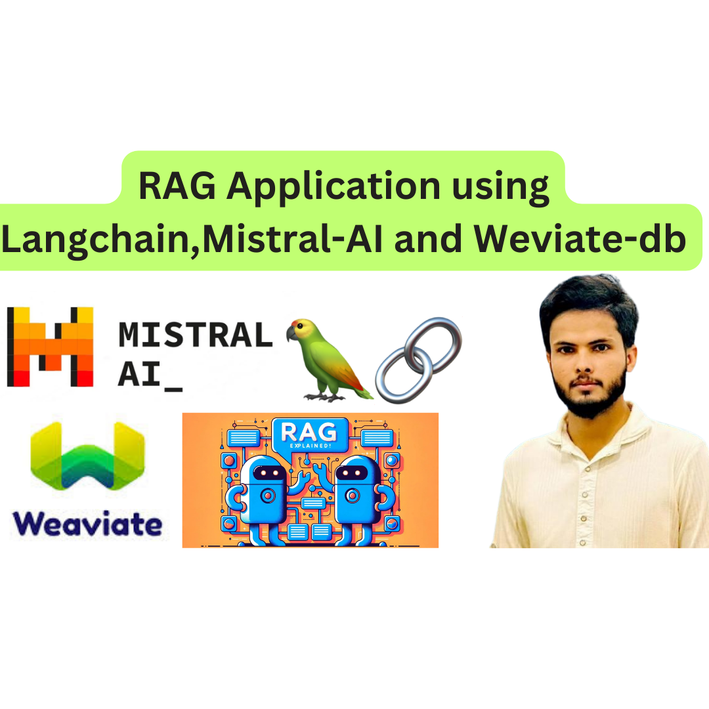

# RAG Application Using LangChain, Mistral AI, and Weaviate



## Overview

This project demonstrates an Augmented Generation (AG) Application that combines **LangChain**, **Mistral AI**, and **Weaviate** in a single Jupyter notebook. This setup enables efficient retrieval and generation of responses to complex queries, blending data retrieval and advanced language generation for robust responses.

## Key Components

- **LangChain**: A powerful framework for interacting with large language models, handling prompt chaining, and managing interactions.
- **Mistral AI**: Language model specializing in accurate and contextually aware text generation.
- **Weaviate**: A vector database that provides fast and accurate similarity search, ideal for storing and retrieving large datasets as vectors.

## Notebook Highlights

1. **Data Retrieval**: The notebook retrieves relevant data vectors using Weaviate, enabling context-rich answers.
2. **Response Generation**: Leveraging LangChain and Mistral, the application generates nuanced responses based on retrieved content.
3. **Combined Workflow**: Through a single notebook, the app demonstrates a complete pipeline from query input to response generation, augmented by retrieved information.

## Requirements

- **Python 3.7+**
- **Jupyter Notebook**
- Access credentials for **LangChain**, **Mistral AI**, and **Weaviate** APIs.

## Setup and Usage

1. **Clone the Repository**:
   ```bash
   git clone https://github.com/yourusername/your-repo.git
   cd your-repo
   ```

2. **Install Dependencies**:
   ```bash
   pip install -r requirements.txt
   ```

3. **Run the Notebook**:
   Open Jupyter Notebook and launch `RAG_Application_Using_LangChain_Mistral_and_Weviate.ipynb`.

   ```bash
   jupyter notebook RAG_Application_Using_LangChain_Mistral_and_Weviate.ipynb
   ```

4. **Execute Cells**:
   Follow the notebook cells in sequence to process sample queries and generate responses.

## Example Query

Try entering a query such as:
- **"Summarize the impact of vector databases on AI applications."**

## Project Structure

- `RAG_Application_Using_LangChain_Mistral_and_Weviate.ipynb` - The main notebook containing the full pipeline for the AG application.
- `mistral_weavate.png` - An image illustrating the architecture or workflow of the application.

## License

This project is licensed under the MIT License.
